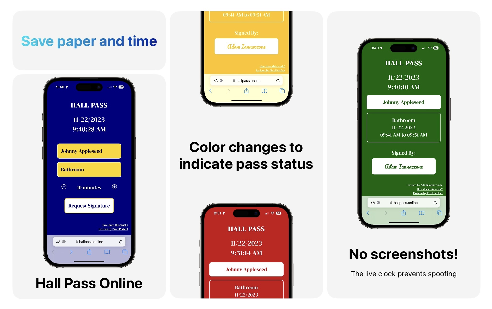

# [Hall Pass Online](https://hallpass.online/)

Tired of writing Hall Passes? This system will allow:
1. A student to input their Name, Destination, and requested time
2. You as the teacher to authenticate and "sign" the pass using a QR code

The system is not perfect, but I wanted something that worked without collecting, storing, or pre-loading any data.

## Setup
1. Optional: Use [this webpage](https://hallpass.online/url-generator.html) to generate a custom URL with your School Name. This will add some personalization to the pass.
2. Create a QR code that links to your custom URL. You will probably want to print this out and hang it on the wall somewhere. You can use the `URL` tab on [QRCode Monkey](https://www.qrcode-monkey.com/#url).
3. Create another QR code that stores your full name. This will act as your "digital signature." You can use the `text` tab on [QRCode Monkey](https://www.qrcode-monkey.com/#text). It's very important that you keep this private! If you don't students can forge your signature. I have mine printed out and taped the back of my ID badge.

## Usage
1.  A student will scan the printed QR code that links your website.
2. They will fill out their hall pass, present the details to you, and hit "Request Hall Pass."
3.  If approved, present your personal QR code to digitally sign the pass.
4. As time progresses, the background color of the pass will change to give a general sense of remaining time. A red pass indicates that it has expired.
5. If the student accidentally closes or refreshes the page, all data is saved in the search parameters, so the pass will remain unmodified when reloaded.

## Privacy
All data is passed between pages using URL Search Parameters, so nothing is tracked or stored.

## Acknowledgements
- The QR Scanner is courtesy of [qr-scanner by nimiq](https://github.com/nimiq/qr-scanner)
- Screenshots created using the free app [Bento Craft](https://github.com/thatvirtualboy/SwiftUI-Bento-Box)